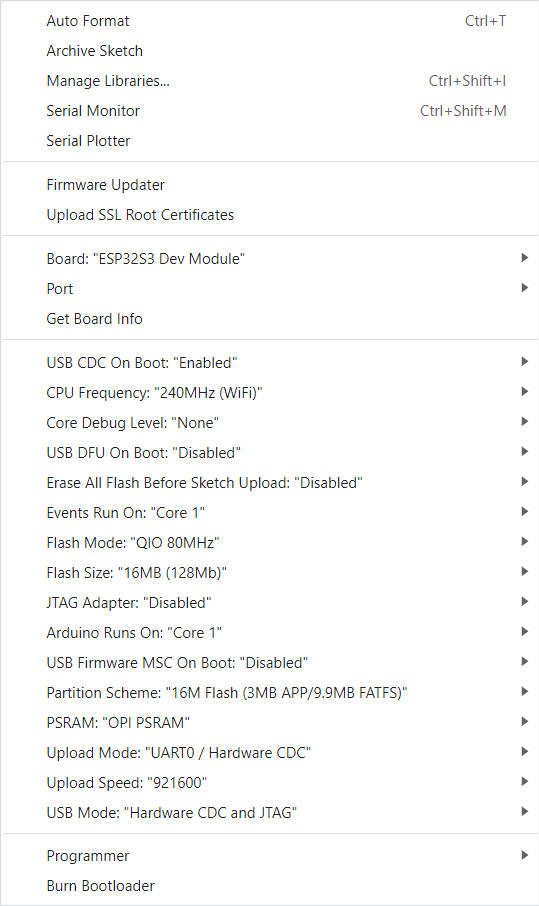
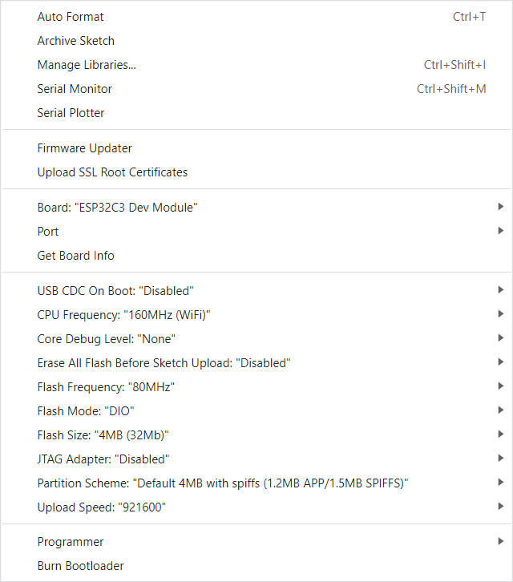

<h1 align = "center">✨ LilyGO T-Deck  ✨</h1>

## **English | [中文](README_CN.MD)**


## 1️⃣ Examples preview

````

examples 
├─Keyboard_ESP32C3       # ESP32C3 keyboard I2C slave
├─Keyboard_T_Deck_Master # T-Deck read from keyboard
├─Microphone             # Noise detection  
├─Touchpad               # Read touch coordinates 
└─UnitTest               # Factory hardware unit testing           

````

## 2️⃣ Quick Start

### PlatformIO

1. Install [VisualStudioCode](https://code.visualstudio.com/) and [Python](https://www.python.org/)
2. Search for the `PlatformIO` plugin in the `VisualStudioCode` extension and install it.
3. After the installation is complete, you need to restart `VisualStudioCode`
4. After restarting `VisualStudioCode`, select `File` in the upper left corner of `VisualStudioCode` -> `Open Folder` -> select the `T-Deck` directory
5. Click on the `platformio.ini` file, and in the `platformio` column, cancel the sample line that needs to be used, please make sure that only one line is valid
6. Click the (✔) symbol in the lower left corner to compile
7. Connect the board to the computer USB
8. Click (→) to upload firmware
9. Click (plug symbol) to monitor serial output


### ArduinoIDE

1. Install [ArduinoIDE](https://www.arduino.cc/en/software)
2. Copy all the folders in the `T-Deck/lib` directory to `<C:\Users\UserName\Documents\Arduino\libraries>`. If there is no `libraries` directory, please create a new one. Please note that you are not copying the `lib` directory, but copying the folders in the lib directory
3. Open ArduinoIDE  ,`Tools` , Look at the picture to choose
    | T-Deck(ESP32S3)      | T-Keyboard(ESP32C3)  |
    | -------------------- | -------------------- |
    |  |  |
4. Insert USB into the PC and click Upload <If the upload fails, keep pressing the BOOT button, click RST, and then click Upload. When the upload is complete, click RST to exit the download mode>

## 3️⃣ Tips:

1. If a microphone is used, the GPIOO button cannot be used
2. If the sketch cannot be uploaded, then you need to press down the middle of the trackball, and then insert the USB, this means the chip is in the download mode, and then click to upload the sketch.
3. T-Keyboard the programming and burning interface of ESP32C3 is located at the 6Pin header on the side of the RST button, and the order starts from the top of the RST button, which are 3V3, GND, RST, BOOT, RX, TX, You need to connect USB TO TTL externally to burn the keyboard firmware. For TTL without automatic download circuit, before powering on, short-circuit the BOOT Pin and GND, and then power on. At this time, T-Keyboard will enter the download mode. After the burning is completed, you need to disconnect GND and BOOT before running the program.

   

4. T-Deck can't upload any sketch，Please enter the upload mode manually.
   1. Connect the board via the USB cable
   2. Press and hold the BOOT button , While still pressing the BOOT(On the trackball above the keyboard, press down) button
   3. Press RST button
   4. Release the RST button
   5. Release the BOOT button
   6. Upload sketch

## 4️⃣ Where to buy:

1. [AliExpress](https://www.aliexpress.com/item/1005005692235592.html)
2. [LilyGo Store](https://www.lilygo.cc/products/t-deck)


## 5️⃣ Pins:

See [utilities.h](./examples//UnitTest//utilities.h)
