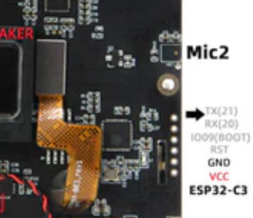

# Write to new users

- This page provides a quick diagnosis of whether the hardware is normal. The firmware in the example table below provides quick testing of the hardware. Please follow the steps below to test
- [T-Deck Plus Touch Fix Record](https://youtu.be/CTdMXJvWZpA)
- [How to write firmware to T-Deck or T-Deck-Plus Record](https://www.youtube.com/watch?v=aSjUyzw_2F4)
- [Discussion about touch repair](https://www.reddit.com/r/meshtastic/comments/1jizmsb/tdeck_touchscreen_not_working_properly/)
- **Please note that if meshtastic is written, the port displayed after plugging in the computer USB is a virtual USB port, not a real port number. You must manually enter the download mode to perform the secondary flash. For how to enter the download mode, please see the FAQ below.**

# 1️⃣ Quickly diagnose hardware

| Firmware Name                                                                      | description                                    |
| ---------------------------------------------------------------------------------- | ---------------------------------------------- |
| [T-Keyboard_Keyboard_ESP32C3_241225.bin](./T-Keyboard_Keyboard_ESP32C3_241225.bin) | [T-Deck Keyboard C3 firmware][1]               |
| [T-Deck_UnitTest_241220.bin](./T-Deck_UnitTest_241220.bin)                         | [T-Deck/T-Deck-Plus function test firmware][1] |
| [firmware-t-deck-v2.5.21.447533a.bin](./firmware-t-deck-v2.5.21.447533a.bin)       | [T-Deck/T-Deck-Plus factory firmware][2]       |
| [T-Deck-Plus-TouchFix_241025.bin](./T-Deck-Plus-TouchFix_241025.bin)               | [T-Deck-Plus Touch Fix][2]                     |
| [T-Deck-Plus-TouchFix_241203.bin](./T-Deck-Plus-TouchFix_241203.bin)               | [T-Deck-Plus Touch Fix][2]                     |
| [T-Deck-Plus-Device-UI-v2.6.5.bin](./T-Deck-Plus-Device-UI-v2.6.5.bin)             | [T-Deck-Plus meshtastic ui firmware][2]        |

⚠⚠⚠

**T-Deck-Plus-TouchFix_241025.bin** Touch repair program, can only be flashed on rounded corner screens, please do not flash this on T-Deck rectangular screens, otherwise the screen touch will fail

**T-Deck-Plus-TouchFix_241025.bin** Touch repair program, can only be flashed on rounded corner screens, please do not flash this on T-Deck rectangular screens, otherwise the screen touch will fail

**T-Deck-Plus-TouchFix_241025.bin** Touch repair program, can only be flashed on rounded corner screens, please do not flash this on T-Deck rectangular screens, otherwise the screen touch will fail


[1]: https://www.lilygo.cc/products/t-deck
[2]: https://www.lilygo.cc/products/t-deck
[3]: https://www.lilygo.cc/products/t-deck

### Use ESP Download Tool

- Download [Flash_download_tool](https://www.espressif.com.cn/sites/default/files/tools/flash_download_tool_3.9.7_0.zip)


* Note that after writing is completed, you need to press RST to reset.
* When writing the keyboard firmware, you need to select ESP32-C3 in the chip type

### Use Web Flasher

- [ESP Web Flasher Online](https://espressif.github.io/esptool-js/)


* Note that after writing is completed, you need to press RST to reset.

### Use command line


If system asks about install Developer Tools, do it.

```bash
python3 -m pip install --upgrade pip
python3 -m pip install esptool
```

In order to launch esptool.py, exec directly with this:

```bash
python3 -m esptool
```

For T-Deck/T-Deck-Plus use the following command to write

```bash
esptool --chip esp32s3  --baud 921600 --before default_reset --after hard_reset write_flash -z --flash_mode dio --flash_freq 80m 0x0 T-Deck_UnitTest_241004.bin

```


For ESP32-C3 Keyboard use the following command to write

```bash
esptool --chip esp32c3  --baud 921600 --before default_reset --after hard_reset write_flash -z --flash_mode dio --flash_freq 80m 0x0 firmware-c3-t-keyboard.bin

```


# 2️⃣FAQ

- Can't upload any sketch，Please enter the upload mode manually.
   1. Connect the board via the USB cable
   2. Press and hold the **BOOT** button , While still pressing the **BOOT** button (On the trackball above the keyboard, press down)
   3. Press **RST** button
   4. Release the **RST** button
   5. Release the **BOOT** button (If there is no **BOOT** button, disconnect IO0 from GND.)
   6. Upload sketch
   7. Press the **RST** button to exit download mode

- T-Keyboard the programming and burning interface of ESP32C3 is located at the 6Pin header on the side of the RST button, and the order starts from the top of the RST button, which are 3V3, GND, RST, BOOT, RX, TX, You need to connect USB TO TTL externally to burn the keyboard firmware. For TTL without automatic download circuit, before powering on, short-circuit the BOOT Pin and GND, and then power on. At this time, T-Keyboard will enter the download mode. After the burning is completed, you need to disconnect GND and BOOT before running the program.

   


## Touch Fix firmware

- Used to try to repair the touch when the touch does not work properly. If the hardware is not damaged, then open the serial after writing, you should be able to see the following log, slide your finger on the touch screen, and you can see the output sliding coordinates

   ```bash

   ESP-ROM:esp32s3-20210327
   Build:Mar 27 2021
   rst:0x15 (USB_UART_CHIP_RESET),boot:0x8 (SPI_FAST_FLASH_BOOT)
   Saved PC:0x420247ee
   SPIWP:0xee
   mode:DIO, clock div:1
   load:0x3fce3808,len:0x44c
   load:0x403c9700,len:0xbe4
   load:0x403cc700,len:0x2a38
   entry 0x403c98d4
   [    88][I][esp32-hal-psram.c:96] psramInit(): PSRAM enabled
   [    94][I][esp32-hal-i2c.c:75] i2cInit(): Initialising I2C Master: sda=18 scl=8 freq=100000
   [    94][I][SensorCommon.tpp:65] begin(): Using Arduino Wire interface.
   [    97][W][Wire.cpp:301] begin(): Bus already started in Master Mode.
   [   104][D][TouchDrvGT911.hpp:584] initImpl(): Probe address ....
   [   112][D][TouchDrvGT911.hpp:588] initImpl(): Probe address is : 0x5D
   [   138][I][TouchDrvGT911.hpp:644] initImpl(): Product id:911
   [   138][D][TouchDrvGT911.hpp:653] initImpl(): Current version char :41
   [   256][D][TouchDrvGT911.hpp:659] initImpl(): WriteConfig version char :0
   [   257][I][TouchDrvGT911.hpp:666] initImpl(): Firmware version: 0x1060
   [   260][I][TouchDrvGT911.hpp:668] initImpl(): Resolution : X = 240 Y = 320
   [   265][I][TouchDrvGT911.hpp:669] initImpl(): Vendor id:57
   [   270][I][TouchDrvGT911.hpp:670] initImpl(): Refresh Rate:10 ms
   [   276][I][TouchDrvGT911.hpp:671] initImpl(): MaxTouchPoint:5
   [   282][I][TouchDrvGT911.hpp:680] initImpl(): Interrupt Mode:  FALLING
   Init GT911 Sensor success!
   Pressed!
   2093ms X[0]:86  Y[0]:152 
   Pressed!
   2198ms X[0]:86  Y[0]:152 
   Pressed!

   ```
